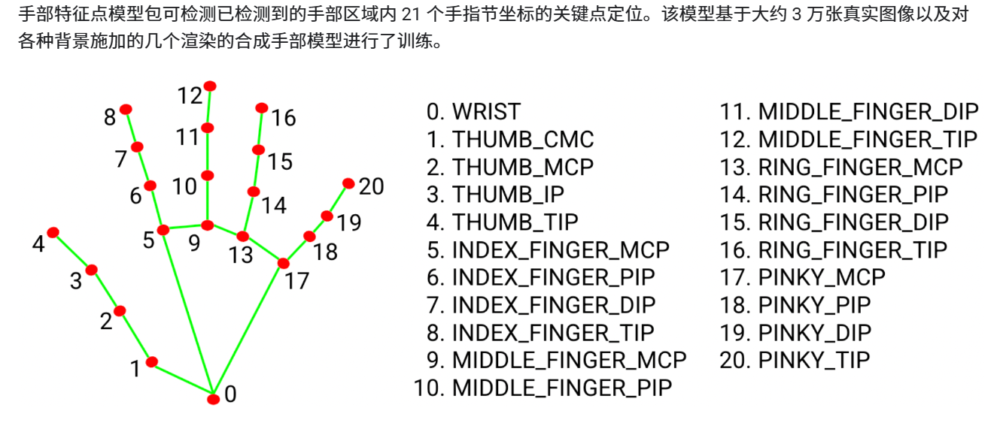

# 注意

主要类实现

```
dex-retargeting/pi_code/HandDetection.py   	手部检测定位类
dex-retargeting/pi_code/Depthcam.py 		相机驱动类
```

Demo

```
dex-retargeting/pi_code/demo_control.py  	手部控制demo
运行方式 python demo_control.py --robot-name shadow  --retargeting-type dexpilot  --hand-type left
使用的手模型--robot-name可参考下方Dex-retargeting更改

dex-retargeting/pi_code/demo.py			手势识别，深度点云获取

dex-retargeting/pi_code/ros_vis_transfer.py	tf转换关系rviz可视化
```

# Setup

1. mediapipe

   1. pip包安装
      1. python -m pip install mediapipe
   2. 预训练模型下载
      1. https://ai.google.dev/edge/mediapipe/solutions/vision/hand_landmarker/python?hl=zh-cn#model
   3. 中心点为5-13号连接中点
   4. 朝向线可取0-mid(9,13)
2. 运行

   1. handdetection.py	实时检测-仅mediapipe
   2. HandDetection.py    Class封装
   3. 

   ```bash
   python3 demo_control.py \
     --robot-name allegro \
     --retargeting-type dexpilot \
     --hand-type left
   ```

# 坐标转换


## 相机平面坐标

    相机视角左上为原点，向下y轴，向右x轴，**注意矩阵横纵轴相反**

## Mediapipe平面坐标

相机视角左上为原点，向下y轴，向右x轴，向外z轴，取值范围0-1

## 手腕坐标系

基于相机点云坐标系，上图红色3D坐标系


手部：

> X轴为手腕到中指第一关节的向量
>
> Z轴为小指关节到食指关节/反向（右手=大拇指方向，左手相反）
>
> Y轴垂直掌心正面向上

## 相机点云坐标系

深度数据的范围为 0.5 米到 4 米

深度摄像头为原点，X 轴向右为正，Y 轴向上为正，Z 轴方向摄像头照射的方向为正。

## 机器人坐标系

z向上，x向前（向相机）


## Mediapipi



# Dex-retargeting

https://github.com/dexsuite/dex-retargeting

[Ref](dex-retargeting/example/vector_retargeting/teaser.webp)

|                 人手                 | svh——5指，较精密            | leap——4指，粗控制          |
| :-----------------------------------: | ----------------------------- | ---------------------------- |
|            allegro——4指            | **shadow——5指，精密** | ability——5指，大拇指单关节 |
| inspire——5指，粗控制，4指无横向运动 | panda——夹爪                 |                              |

cd example/vector_retargeting

python3 capture_webcam.py --video-path data/my_human_hand_video.mp4

python3 detect_from_video.py
  --robot-name allegro
  --video-path data/my_human_hand_video.mp4
  --retargeting-type dexpilot
  --hand-type right
  --output-path data/allegro_joints.pkl

python3 render_robot_hand.py
  --pickle-path data/allegro_joints.pkl
  --output-video-path data/allegro.mp4
  --headless

python3 show_realtime_retargeting.py
  --robot-name panda
  --retargeting-type dexpilot
  --hand-type left
